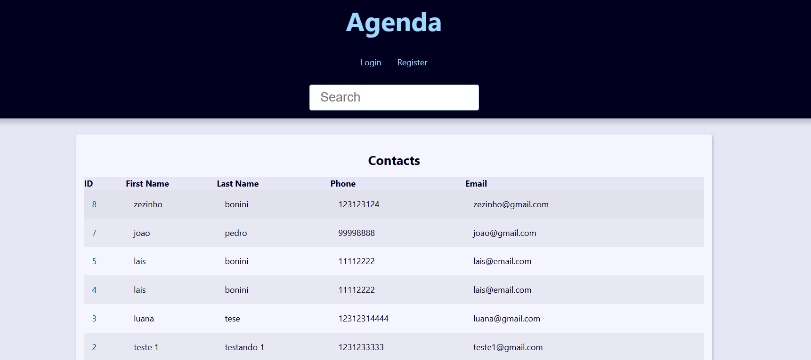

# Django User Registration System

This project is a user registration system built with de Django framework. This application enables users to efficiently view people's information and register new ones if you are logged in. Not only but also update and delete the registrations if you are the owner of the registration, in other words, you can update and delete if you are the person that registered that user.

It is worth remembering that this project is not completely finished.

/

### Features

- **User Registration**: Easily add, edit, or delete user details.
- **Login  System**: Register and log in as a superuser, in the site to manage the user 
- **Save User Photo**: Not only save user infos, but this project can also save user photos and update it.

### Installation

To get this project running on your local machine, follow these steps:

1. Clone the repository:
```bash
git clone https://github.com/LuisHb211/Django-User-Registration-System.git
```
2. Navigate to the project directory:
```bash
cd Django User Registration System
```
3.  Create the virtual environment:
```bash
python -m venv venv
```
4. Activate the virtual environment:
```bash
.\venv\Scripts\activate 
```
5.  Install the requirements:
```bash
pip install -r requirements.txt 
```
6. Create the database:
```bash
python manage.py makemigrations
```
```bash
python manage.py migrate
```

### Django Secret Key

To use the application, you’ll need a Django SECRET_KEY. Generate one by running the following script in the terminal:
```bash
python generate_secret_key.py
```
Once generated, open settings.py and paste the key in the SECRET_KEY variable.

### Usage

Start the server:
```bash
  python manage.py runserver
```
To use the application, navigate to `http://localhost:8000` in your web browser after starting the server.

It is worth remembering that the user that are logged in or created at link 'Register' is a super user in Django, but don't have all the superuser permissions. If you want to have this kind of superuser you have to create it by code:

```bash
  python manage.py createsuperuser
```

## 🛠️ Built with

* [Visual Studo Code](https://code.visualstudio.com/)  
* [Python](https://www.python.org/)
* [Django](https://www.djangoproject.com/)
* [Git](https://git-scm.com/) 

### Contributing

1. Fork the repository.
2. Create a new branch (`git checkout -b feature-branch`).
3. Make your changes.
4. Submit a pull request.